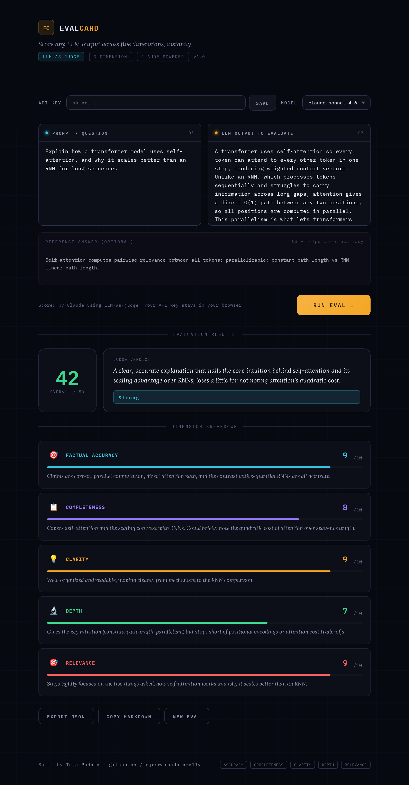

# EVALCARD — LLM Output Scorer

**Score any LLM response across 5 dimensions in seconds, using LLM-as-judge.**

A lightweight, single-file evaluation tool that takes a prompt and one LLM output, sends both to Claude as a judge, and returns a structured 50-point scorecard with per-dimension justifications.

No backend. No build step. Open the HTML file, add your Anthropic API key, and score one output at a time.

---

## Screenshot



*Illustrative scorecard rendered from `evalcard.html`. Scores and justifications above are a sample for demonstration.*

---

## Live Demo

→ [Open `evalcard.html`](./evalcard.html) directly in your browser. No server or build step.

---

## How It Works

EVALCARD uses the **LLM-as-judge** evaluation pattern:

```
[Your Prompt] + [LLM Output] + [Optional Reference Answer]
        ↓
  Claude (as judge)
        ↓
  5-Dimension Scorecard + Verdict
```

The judge prompt instructs Claude to score the output on five criteria and return a structured JSON response. EVALCARD parses that JSON and renders it into a visual scorecard with score bars, justifications, and an overall grade.

---

## The 5 Dimensions

| Dimension | What it measures | Max |
|---|---|---|
| **Factual Accuracy** | Are claims correct and verifiable? Penalizes hallucinations. | 10 |
| **Completeness** | Does it address all parts of the prompt? | 10 |
| **Clarity** | Is it well-organized and easy to follow? | 10 |
| **Depth** | Does it go beyond surface-level? Rewards insight and nuance. | 10 |
| **Relevance** | Does it stay focused on what was asked? | 10 |

**Total: 50 points.** Verdict grades: `Excellent` / `Strong` / `Adequate` / `Weak` / `Poor`.

---

## Setup

1. Clone or download this repo
2. Open `evalcard.html` in any modern browser (no server required)
3. Enter your [Anthropic API key](https://console.anthropic.com/) — stored locally in your browser, never sent anywhere else
4. Select a model (Sonnet 4.6 recommended for best judge quality)
5. Paste a prompt and an LLM output → click **Run Eval**

> The optional **Reference Answer** field improves accuracy scoring when you have a known ground truth.

---

## Use Cases

EVALCARD scores one output per run. Each of the workflows below is done by running multiple
evals and saving the exported results yourself — there is no built-in comparison, diff, or history.

- **Model comparison** — score outputs from different models on the same prompt one at a time, then compare the exported scorecards side by side
- **Prompt iteration** — re-run the same eval after a prompt rewrite to see how the scores move
- **Output review** — capture a structured quality read on an output before shipping
- **Eval dataset building** — export per-output JSON to assemble a small labeled set by hand

---

## Export

- **Export JSON** — full result object with scores, justifications, model, and timestamp
- **Copy Markdown** — formatted scorecard ready to paste into a doc or Notion

---

## Architecture

| Component | Detail |
|---|---|
| **Pattern** | LLM-as-judge |
| **Judge model** | Claude Sonnet 4.6 (default), Opus 4.6, or Haiku 4.5 |
| **API** | Anthropic Messages API (`/v1/messages`) |
| **Output format** | Structured JSON (parsed from judge response) |
| **Stack** | Single HTML file — vanilla JS, no dependencies |
| **Storage** | API key in `localStorage` only |

---

## Limitations

- Scores reflect Claude's judgment and inherit its biases — treat as directional, not ground truth
- LLM judges tend to cluster scores in the 5–8 range; treat scores below 5 or above 9 as directionally significant rather than precise
- Accuracy scoring without a reference answer is inherently limited
- Not a replacement for human evaluation on high-stakes tasks
- Rate limits apply based on your Anthropic API tier

---

## Author

Built by [Teja Padala](https://linkedin.com/in/teja-padala/) — Senior AI/ML Product Manager  
[github.com/tejaswarpadala-a11y](https://github.com/tejaswarpadala-a11y)

---

## License

[MIT](./LICENSE) © 2026 Teja Padala
